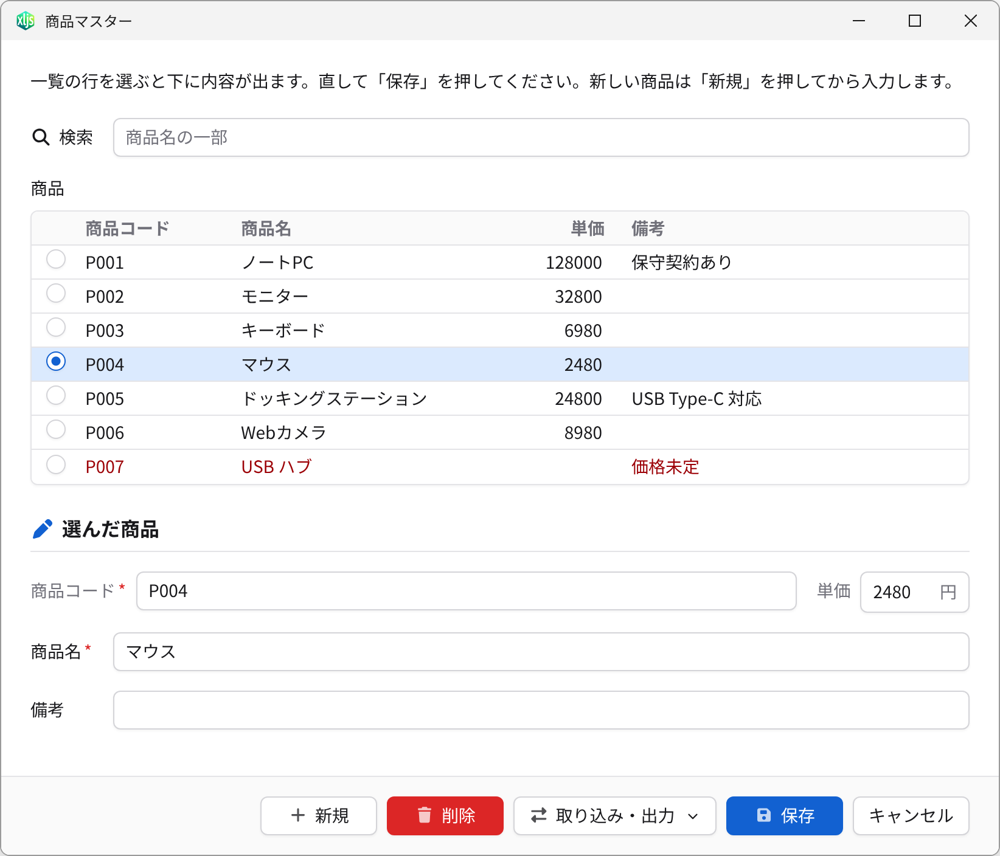
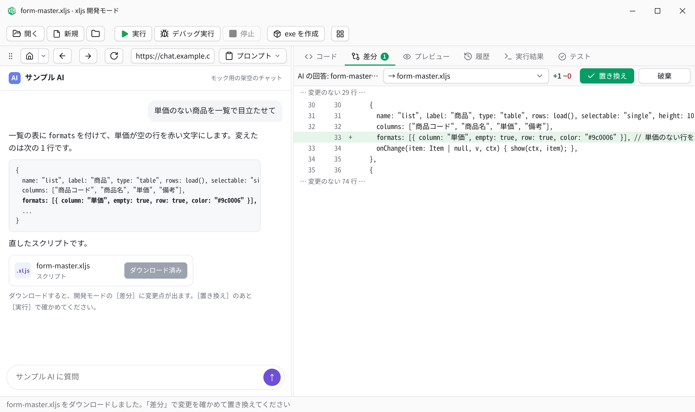
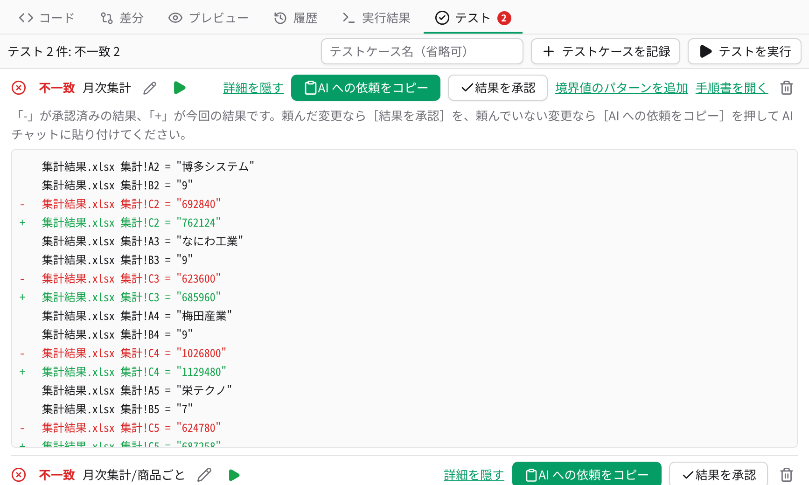
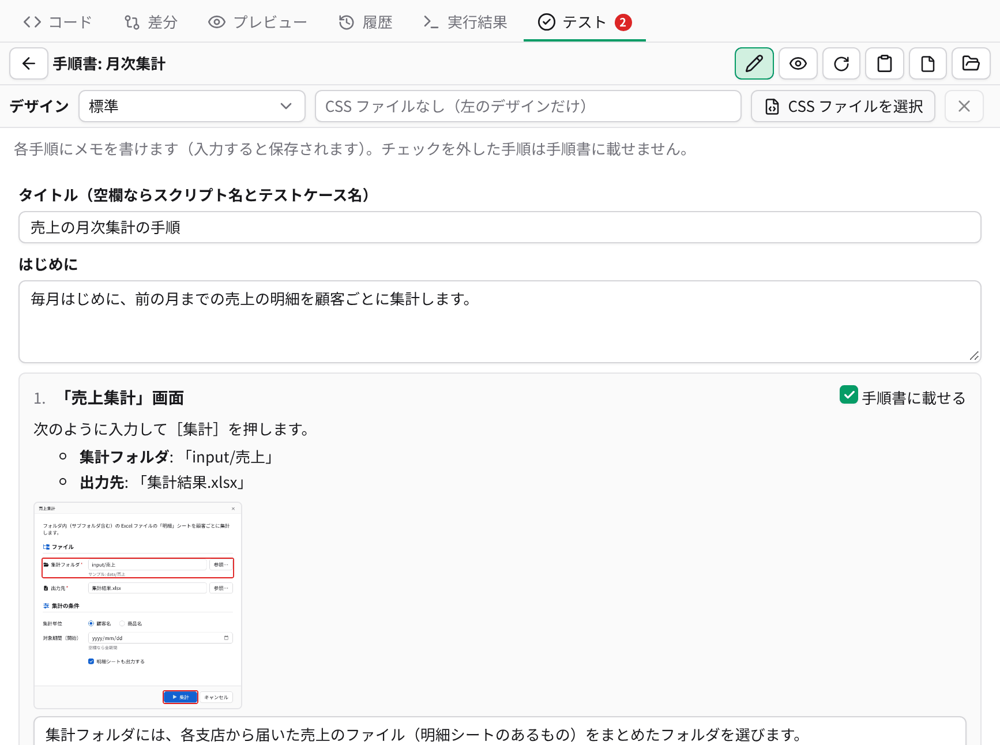

#  xljs

JavaScript / TypeScript で書いたスクリプトで Excel・CSV の集計やデータ変換を行う、Windows 用のシングルバイナリです。入力して実行するツールから、一覧・検索・登録の画面を持つ業務アプリまで、HTML を書かずに作れます。Excel のインストールは不要です。



## 主な特徴

- **exe 1 つで動く**: インストーラーも Node.js も要りません。exe とスクリプトを置くだけで動き、作ったスクリプトは exe にまとめて配れます
- **Excel・Acrobat 不要**: xlsx の読み書きと数式の計算、Excel で印刷したときと同じページの PDF 出力、PDF の結合・ページの削除・回転・文字の追加まで、Excel や Acrobat の入っていないパソコンで行えます
- **開発モード**: 普段使っている AI チャット（Copilot・Gemini・ChatGPT・Claude など）とスクリプトを並べた画面で、回答の差分を確かめて置き換え、その場で実行できます。エラーの場所と AI への依頼文、フォームのプレビュー、置き換えの履歴も同じ画面にあります
- **簡易テスト・手順書の作成**: 一度操作した内容を記録して、スクリプトを直したあとに同じ操作で再生し、出力が変わっていないかを確かめられます。記録した操作から、画面の画像付きの手順書（マニュアル）も作れます



<table>
<tr>
<td width="50%"></td>
<td width="50%"></td>
</tr>
<tr>
<td>テスト: 承認済みの結果（-）と今回の結果（+）の違い</td>
<td>手順書: 記録した操作から画面の画像付きで作成</td>
</tr>
</table>

## スクリプトの例

フォルダ内の Excel ファイルの「明細」シートを 1 つのブックに集めます。

```js
const dir = await showDirectoryPicker();
if (!dir) exit();

const rows = [];
for (const h of ui.withProgress(dir.walk("*.xlsx"), { title: "集計中" })) {
  const book = excel.open(h);
  for (const r of book.sheets["明細"]?.toRowObjects() ?? []) rows.push({ ...r, ファイル: h.relativePath });
}

const dest = await showSaveFilePicker({ suggestedName: "集計結果.xlsx" });
if (dest) {
  const out = excel.create();
  out.addSheet("明細").write(rows);
  out.save(dest);
  alert(`${rows.length} 件を集計しました`);
}
```

- **言語**: ES2023 相当（オプショナルチェーン、`??`、async/await、トップレベル await、クラスフィールドなど）と TypeScript。`import` でファイル分割可能
- **ファイル操作**: ブラウザの File System Access API 風（`showOpenFilePicker` / `FileSystemFileHandle` など）＋ フォルダ走査などの独自拡張
- **Excel**: xlsx の読み書きと数式の計算。値は数値・文字列・真偽値・`Date` で受け渡し
- **PDF**: Excel で印刷したときと同じページでの PDF 出力（WebView2）、PDF の結合・ページの削除・挿入・回転・文字の追加（Excel・Acrobat 不要）
- **CSV / JSON**: Shift_JIS(CP932) / UTF-8 の自動判定、BOM 付き UTF-8 での書き出し、JSON Lines
- **エクスプローラー連携**: 出力したファイルを選択した状態でエクスプローラーを開く、既定のアプリで開く
- **UI**: Windows ネイティブのダイアログ（メッセージボックス、ファイル選択、進捗ダイアログ）、フォーム（HTML を書かずに作る画面。入力して実行するツールから、一覧・登録のあるアプリまで）・表・グラフ・印刷プレビュー・HTML の画面（WebView2）。コンソールでも動作
- **その他**: SQLite（ファイルサーバーでの共有も）、Web API（`fetch`）、Active Directory、プログラムの実行、exe へのパック、VBA マクロ・数式の取り出し

## ドキュメント

**リファレンス: https://cool0707.github.io/xljs/**

- [ファーストステップ](https://cool0707.github.io/xljs/guide/first-steps.html) — ダウンロードからサンプルの実行、開発モードで作り始めるまで
- [実行ファイルと引数](https://cool0707.github.io/xljs/guide/run.html) — コマンドとオプション
- [API](https://cool0707.github.io/xljs/api/globals.html) — 機能ごとの説明と、型定義から作ったリファレンス
- [サンプル](examples/README.md)
- [AI チャットでスクリプトを作る](docs/ai/README.md) — Claude・Gemini・Copilot などに渡すプロンプトとリファレンス
- [開発者向けメモ](docs/development.md) — ビルド、テスト、ドキュメントの構成

## ダウンロード

[Releases](https://github.com/cool0707/xljs/releases) から `xljs-windows-x64.zip`（ARM は `xljs-windows-arm64.zip`）を取得し、`xljs.exe` にスクリプトをドラッグ＆ドロップして実行します。zip の `examples/` にサンプルと、それで試せるデータが入っています。

## ライセンス

Apache License 2.0（[LICENSE](LICENSE)）。移植元の Go 版 xljs は MIT ライセンスです。

主に使っているライブラリ: xlsx の読み書きは [umya-spreadsheet](https://github.com/MathNya/umya-spreadsheet)（Excel との互換のために直したフォーク [cool0707/umya-spreadsheet](https://github.com/cool0707/umya-spreadsheet)）、スクリプトの実行は QuickJS（[rquickjs](https://github.com/DelSkayn/rquickjs)）、TypeScript の変換は [oxc](https://github.com/oxc-project/oxc)、PDF の編集は [lopdf](https://github.com/J-F-Liu/lopdf)、SQLite は [rusqlite](https://github.com/rusqlite/rusqlite)。

同梱のライブラリ: 数式の計算エンジン [GridCraft](https://github.com/storytold/gridcraft) の一部（MIT または Apache-2.0、`vendor/gridcraft`）、Day.js（MIT、`src/api/dayjs/LICENSE`）、Font Awesome Free（アイコン CC BY 4.0・フォント SIL OFL 1.1・CSS MIT、`src/ui/web/fontawesome/LICENSE.txt`）、画面で使う AG Charts Community・Frappe Gantt・CodeMirror など（[`src/ui/web/vendor/VERSIONS.md`](src/ui/web/vendor/VERSIONS.md)）。
